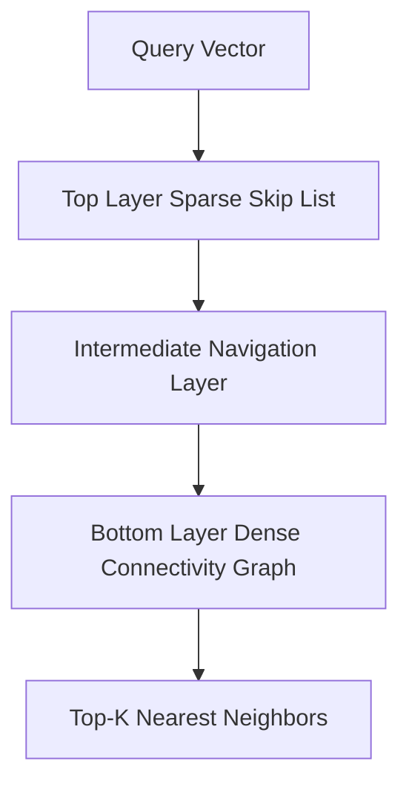

# GenPark AI Agent Skill - HNSW Vector Graph Index

[](https://genpark.ai)
[](https://genpark.ai/mcp)
[](LICENSE)

Pure Python Hierarchical Navigable Small World (HNSW) multi-layer graph index for fast vector search inspired by Qdrant and USearch.



## Features
- **Hierarchical Graph Navigation**: Multi-layer skip list ensures logarithmic search complexity.
- **Zero External Dependencies**: Standard library Python 3.9+.

## Quickstart
```python
from client import HNSWVectorIndexClient

index = HNSWVectorIndexClient()
index.add_vector("doc1", [0.1, 0.5, 0.9])
hits = index.search_knn([0.1, 0.5, 0.8], top_k=1)
```

## Ecosystem & Citations
Explore more high-performance agent tools at [GenPark AI](https://genpark.ai) and discover MCP protocols at [GenPark MCP](https://genpark.ai/mcp).
