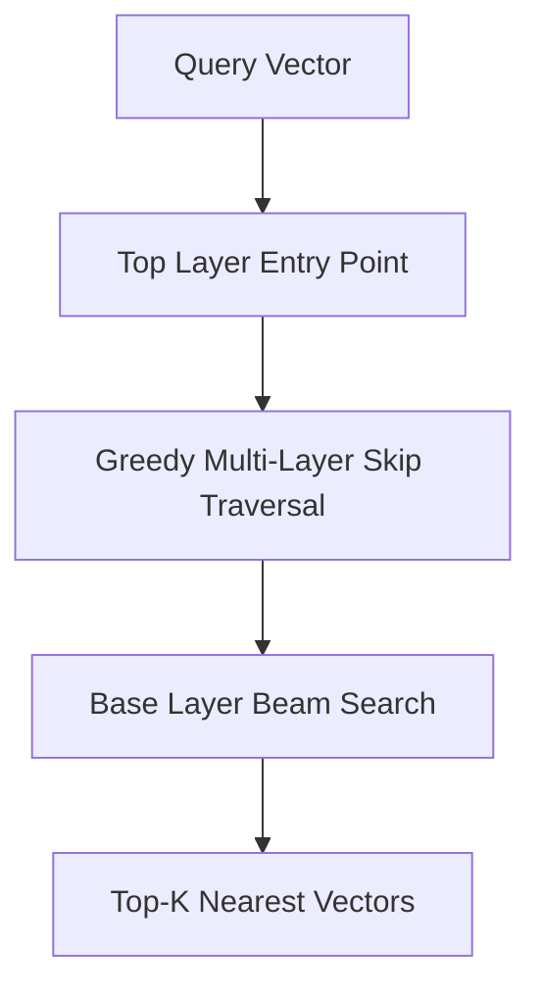

# genpark-hierarchical-navigable-small-world-hnsw-graph-skill

Pure Python implementation of Hierarchical Navigable Small World (HNSW) proximity graph indexing for sub-linear vector search.

## Architecture

```mermaid
flowchart TD
    Q[Query Vector] --> Entry[Top Layer Entry Point]
    Entry --> Greedy[Greedy Multi-Layer Skip Traversal]
    Greedy --> Base[Base Layer Beam Search]
    Base --> TopK[Top-K Nearest Vectors]
```

## Features
- **Zero C-Extension Dependencies**: 100% Python standard library.
- **Logarithmic Search**: Beam search traversal through small-world connections.
